# DinoParkour开发文档

# 1. 玩法分析

**游戏原型：**
chrome://dino/

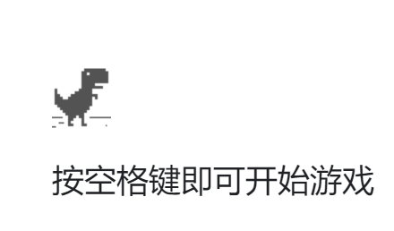

该游戏是谷歌浏览器自带的一款恐龙跑酷小游戏。
当在无网络的情况下使用谷歌浏览器访问网站时会出现一个小恐龙，再按下空格就可以触发这个小游戏了。

在该游戏中，玩家通过键盘操控小恐龙进行跑酷，躲避各种沙漠上的障碍物来取得高分。

**游戏目标：**
躲过更多障碍，跑的更远以取得更高的分数

**得分计算：**
小恐龙存活时间就是得分

**玩家操作：**
玩家可以通过按钮(移动端)键盘(pc)端等方式来操控小恐龙进行跑酷。
可以操作的动作：

- 下箭头：低头
- 上箭头：跳跃

**失败判定：**
小恐龙碰到任何障碍物就触发游戏失败

# 2. 需求分析

## 2.1 游戏实体分析

### 2.1.1 总分析

**主要实体：**

- 小恐龙Dino 1个
- 陆地Land 动态生成
- 背景墙TimeRing 1个

其中动态生成的陆地中应该动态生成多个障碍实体

**障碍实体：**

- 仙人掌Cactu 共10种
  - 单体仙人掌 5种
  - 双体仙人掌 3种
  - 三体仙人掌 1种
  - 四体仙人掌 1种
- 翼龙Pterosaur 1种

每种障碍实体的碰撞体积均不相同

**其它实体：**

- 灯光Light
- 摄影机MainCamera

### 2.1.2 实体动画分析

应当设计动画的实体主要是小恐龙与翼龙：

#### 2.1.2.1 小恐龙动画分析

**状态分析：**

- 开始状态Start:0 (1帧)
- 奔跑状态Run:1 (2帧)
- 跳跃状态Jump:2 (1帧)
- 低头状态DownRun:3 (2帧)
- 死亡状态Dead:4 (1帧)

**状态机**如下图所示：
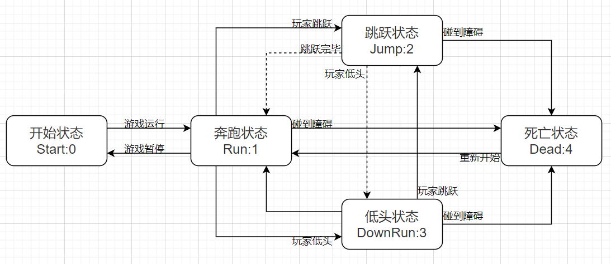

> 其中:
>
> - 实线为可打断当前状态进行状态转换
> - 虚线为当前状态执行完毕前不可打断

**需求：**6张美术素材
小恐龙共需要6张美术素材用于制作帧动画，其中跳跃帧和开始帧可共用一张

#### 2.1.2.2 翼龙动画分析
**状态分析：**
仅需要一种状态

- 奔跑状态 2帧

**需求：**2张美术素材
翼龙共需要2张美术素材

### 2.1.3 障碍实体动态生成分析

障碍实体应当动态生成在陆地实体上，而陆地实体也是动态生成的，所以这两者用预制体实现比较合适。

**障碍实体动态生成需求：**

- 随机生成种类
- 随机生成个数
- 随机生成的障碍实体的碰撞体积要与种类相关有所变化

**陆地实体动态生成需求：**

- 同一时间游戏内应当有三个陆地实体
  - 正在运行的陆地实体 (1个)
  - 准备运行的陆地实体 (2个)
- 运行到指定位置自动销毁
- 运行到指定位置自动启动下一个陆地实体
- 陆地上动态生成的障碍实体数量应该在0-2之间随机
- 陆地上动态生成的障碍实体的位置应该是固定的
  如果随机位置，容易挨在一起造成死局
- 陆地的运动速度应该随着分数的提高而提高

### 2.1.4 背景墙分析

**背景墙需求：**

- 是个时间环，通过转动来展示昼夜变化
- 时间环的转动要与灯光配合，展示昼夜光线变化

## 2.2 美术分析

**美术风格：**
彩色像素风格

**美术需求清单：**(按优先级排序)

1. 小恐龙的六张帧序列用于制作各种状态的动画
2. 多种障碍实体(详见实体分析)
   - 仙人掌 十张
   - 翼龙 两张
3. 陆地
4. 背景时间环
5. 各种UI制作
6. 游戏LOGO

## 2.3 UI分析

 ### 2.3.1 UI需求树

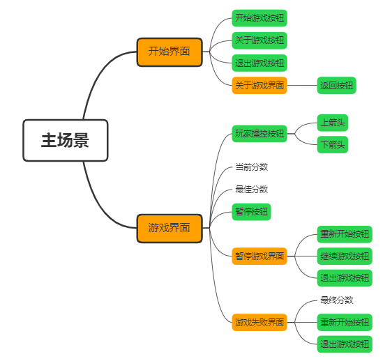

### 2.3.2 细节需求

- 开始界面

  - 三个主要按钮需要支持键盘选择
  - 三个主要按钮需要支持选中提示(键盘与鼠标)

- 游戏界面

  - 当前分数需要实时刷新
  - 最佳分数在每次开始游戏时需要读取

- 游戏失败界面

  - 当玩家取得更高的分数时，需要弹出提示并保存新最佳分数

## 2.4 音效分析

- 游戏BGM
  8bit音乐
- 小恐龙音效
  - 跳跃音效
  - 死亡音效
- 游戏音效
  - 开始游戏音效
  - 每百分音效
  - 新分数音效

共需要8bit风格音效6段。

# 3. 代码实现

## 3.1 工程类图

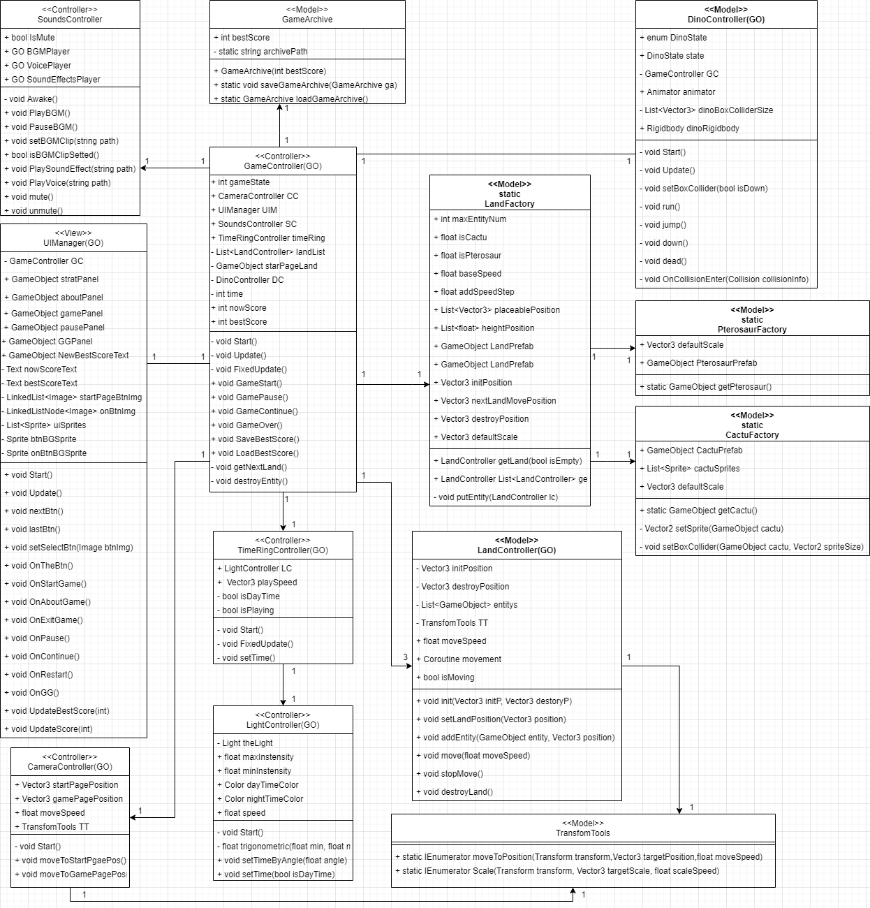

## 3.2 UI实现

**开始界面UI：**

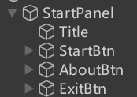

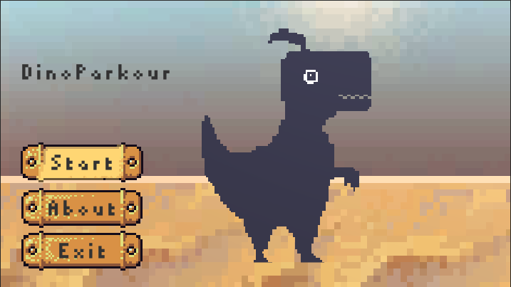


**关于界面UI：**

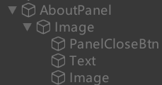


**游戏界面UI：**

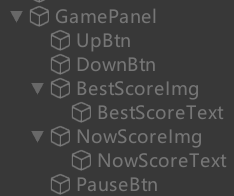

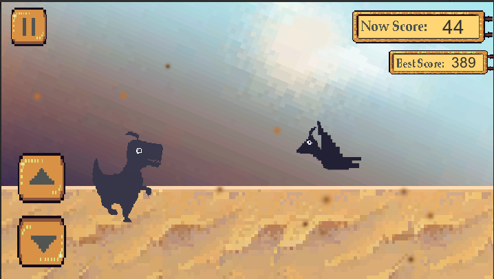

**暂停界面UI：**

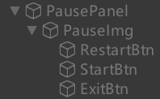

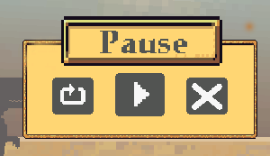

**失败界面UI：**

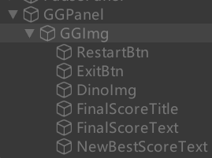

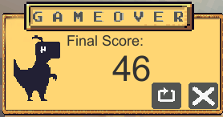

## 3.3 技术实现两点与难点

### 3.3.1 开始界面UI的多种响应方式

#### 3.3.1.1 效果描述

根据UI需求分析中的细节部分对于开始界面UI的描述，我们可以知道，该UI需要支持三种操作方式：

- 鼠标操作
- 键盘方向键操作
- 移动端触摸操作

其中鼠标操作与键盘方向键操作时，会有一个选中的按钮变色的效果。

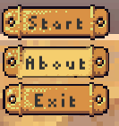
当使用键盘选中about按钮或者光标落在上面时，颜色变浅。

该效果实现的难点主要在鼠标与键盘两种操作方式上，移动端的触摸输入使用普通的按钮响应函数即可

#### 3.3.1.2 键盘方向键操作

在该操作模式下，会默认选中第一个Start Game按钮并使其变色，按上下键可以变更选中的按钮。

想要实现这种效果，我想到了使用双向循环链表，将三个按钮按顺序放入循环链表中，每次按下方向就到下一个节点的按钮，以此类推。

在C#中，可以使用LinkedList(双向链表)加一点小改动，就能成满足我们需求的双向循环链表，代码如下：

**初始化双向循环链表：**

```c#
//循环链表，里面装的是每个按钮的背景图片组件
private LinkedList<Image> startPageBtnImg;
//当前选中的链表节点
private LinkedListNode<Image> onBtnImg;
//普通按钮背景图片精灵
private Sprite btnBGSprite;
//被选中的按钮背景图片精灵
private Sprite onBtnBGSprite;

// 初始化循环链表
void initBtnLinkedList()
{
    startPageBtnImg = new LinkedList<Image>();
	startPageBtnImg.AddLast(GameObject.Find("StartBtn").GetComponent<Image>());
	startPageBtnImg.AddLast(GameObject.Find("AboutBtn").GetComponent<Image>());
	startPageBtnImg.AddLast(GameObject.Find("ExitBtn").GetComponent<Image>());
	//设置当前选中的按钮为 StartBtn
	onBtnImg = startPageBtnImg.First;
}

// 玩家键盘输入监听函数
void Update()
{
    if (Input.GetKeyDown(KeyCode.Space) || Input.GetKeyDown(KeyCode.Return))
        OnTheBtn();
    if (Input.GetKeyDown(KeyCode.UpArrow))
        lastBtn();
    if (Input.GetKeyDown(KeyCode.DownArrow))
        nextBtn();
}

// 按钮的切换函数
// 按下下方向箭头时选中下一个按钮并更改按钮背景
public void nextBtn()
{
    onBtnImg.Value.sprite = btnBGSprite;//将当前按钮背景图改为普通背景图
    onBtnImg = onBtnImg.Next;//将当前被选中按钮改为下一个按钮
    if (onBtnImg == null)//如果倒了链表尾
        onBtnImg = startPageBtnImg.First;//手动循环链表
    onBtnImg.Value.sprite = onBtnBGSprite;//将更改后的选中按钮的背景图改为选中背景图
}
// 按下上方向箭头时选中上一个按钮并更改按钮背景
public void lastBtn()
{
    onBtnImg.Value.sprite = btnBGSprite;
    onBtnImg = onBtnImg.Previous;
    if (onBtnImg == null)//手动循环链表
        onBtnImg = startPageBtnImg.Last;
    onBtnImg.Value.sprite = onBtnBGSprite;
}

// 按钮执行的函数
public void OnTheBtn()
{
	string btnName = onBtnImg.Value.gameObject.name;
	if (btnName == "StartBtn")
        OnStartGame();
    else if (btnName == "AboutBtn")
        OnAboutGame();
    else
        OnExitGame();
}
```

#### 3.3.1.3 鼠标操作模式

在鼠标操作模式下，则需要使鼠标放在哪个按钮上，哪个按钮就成为选中按钮。
所以实现的关键就在于检测鼠标是否在按钮上，鼠标在哪个按钮上。

这就需要用到Unity封装好的一些UI事件接口了。
详细内容可以看：[UI事件接口](https://mycroftcooper.github.io/2021/09/07/Unity-UGUI-%E4%BA%8B%E4%BB%B6%E6%8E%A5%E5%8F%A3/)

在这里需要用到的只有两个接口：

- **IPointerEnterHandler**
  鼠标移入对象时触发响应函数
- **IPointerExitHandler**
  鼠标移出对象时触发响应函数

因为这两个接口是面对对象的，使用应该写一个脚本挂到对应的按钮上去。
脚本代码如下：

```c#
using UnityEngine;
using UnityEngine.EventSystems;
using UnityEngine.UI;

public class StartPageBtnController : MonoBehaviour, IPointerEnterHandler, IPointerExitHandler
{
    //UI控制器，管理所有按钮响应函数
    UIManager UIM;
    private void Start()
        => UIM = GameObject.Find("UI").GetComponent<UIManager>();
    // 鼠标移入按钮时触发该响应函数
    public void OnPointerEnter(PointerEventData eventData)
		// 将该按钮的背景图片组件发送至UI控制器
        => UIM.setSelectBtn(gameObject.GetComponent<Image>());
	// 鼠标移出按钮时触发该响应函数
    public void OnPointerExit(PointerEventData eventData)
        => UIM.setSelectBtn(null);
}
```

将这个写好的StartPageBtnController挂在到需要该功能的那三个按钮上后，再去UI控制器里编写响应函数setSelectBtn。
代码如下：

```c#
public void setSelectBtn(Image btnImg)
{
    if (btnImg == onBtnImg.Value)//如果选中按钮没变，就啥也不干
        return;
    onBtnImg.Value.sprite = btnBGSprite;//先将当前的选中按钮背景图复原
    if (btnImg != null)//如果没有按钮被选中，就选中默认按钮
    {
        onBtnImg = startPageBtnImg.Find(btnImg);
        onBtnImg.Value.sprite = onBtnBGSprite;
    }
    else//有选中按钮，就把选中的按钮赋值给当前选中按钮节点
    {
        onBtnImg = startPageBtnImg.First;
        onBtnImg.Value.sprite = onBtnBGSprite;
    }
}
```

这个功能就这样实现了。

### 3.3.2 动画器与状态机的使用

#### 3.3.2.1 状态机的设置

根据实体分析中对小恐龙Dino的状态机分析图(下图)


可以在Unity中制作动画器，并设置好状态机
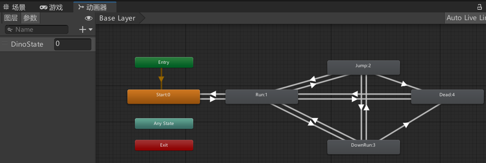

动画转变的判断参数是 int DinoState

#### 3.3.2.2 代码实现

将动画器结合使用简单状态模式的脚本DinoController一起使用，就完成了对小恐龙的状态控制与动画播放。
代码如下：

```c#
using System.Collections.Generic;
using UnityEngine;

public class DinoController : MonoBehaviour
{
    public enum DinoState { Start, Run, Jump, Down, Dead }
    //小恐龙状态：0:开始 1:跑 2:跳 3:低头 4:死亡
    public DinoState state;
    // 利用属性来完成简单的状态改变响应函数
    public DinoState State
    {
        get
        {
            state = (DinoState)animator.GetInteger("DinoState");
            return state; }
        set
        {
            state = value;
            animator.SetInteger("DinoState", (int)value);
            switch (value)
            {
                case DinoState.Run:
                    run();
                    break;
                case DinoState.Jump:
                    jump();
                    break;
                case DinoState.Down:
                    down();
                    break;
                case DinoState.Dead:
                    dead();
                    break;
            }
        }
    }

    private GameController GC;
    public Animator animator;
    private List<Vector3> dinoBoxColliderSize
        = new List<Vector3> { new Vector3(2.5f, 3f, 1f), new Vector3(4f, 2f, 1f) };
    public Rigidbody dinoRigidbody;

    private void Start()
    {
        GC = GameObject.Find("GameController").GetComponent<GameController>();
        animator = gameObject.GetComponent<Animator>();
        dinoRigidbody = gameObject.GetComponent<Rigidbody>();
    }
    // 监听用户输入来改变小恐龙状态
    private void Update()
    {
        if (GC.gameState != 1)
            return;
        if (Input.GetKey(KeyCode.UpArrow))
            State = DinoState.Jump;
        if (Input.GetKey(KeyCode.DownArrow))
            State = DinoState.Down;
        if (Input.GetKeyUp(KeyCode.DownArrow))
            State = DinoState.Run;
    }
	
    // 当状态改变后更改小恐龙碰撞体积
    private void setBoxCollider(bool isDown)
    {
        BoxCollider bc = gameObject.GetComponent<BoxCollider>();
        if (isDown)
            bc.size = dinoBoxColliderSize[1];
        else
            bc.size = dinoBoxColliderSize[0];
    }
    
    //状态改变响应函数
    private void run()
        => setBoxCollider(false);
    private void jump()
    {
        if (transform.position.y > 0)
            return;
        setBoxCollider(false);
    }
    private void down()
        => setBoxCollider(true);
    private void dead()
        => dinoRigidbody.isKinematic = true;

    // 碰撞检测响应函数，发送碰撞后将小恐龙状态设置为死亡
    void OnCollisionEnter(Collision collisionInfo)
    {
        if (collisionInfo.gameObject.name == "LandPrefab" || collisionInfo.gameObject.name == "LandPrefab(Clone)")
            return;
        State = DinoState.Dead;
        GameObject.Find("GameController").GetComponent<GameController>().GameOver(); 
    }
}
```

#### 3.3.2.3 需要注意的点

##### 状态的可打断性：

在状态机分析图中分两种箭头：

- 实线箭头
  该状态的转换过程可以打断当前状态
- 虚线箭头
  该状态的转换过程不可以打断当前状态，只能等当前状态的动画播放完毕才能进行状态转换

想在Unity的状态机中实现这种设定，需要更改**有退出时间**属性：
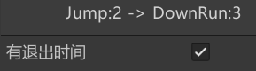

- 可打断则不勾选
- 不可打断则勾选

> 如果不做此调整会导致用户输入被延迟到状态动画播放完后执行，导致输入延迟验证，影响玩家体验

##### 状态的自动转换：
当跳远状态的动画播放完毕后，应当自动切换至奔跑状态。

为了实现这个功能，就需要使用动画的回调函数接口了。
详细可以阅读我的个人博客：[Unity-动画-回调函数接口]([ - Mycroft's Blog (mycroftcooper.github.io)](https://mycroftcooper.github.io/2021/09/07/Unity-动画-回调函数接口/)****)

而在这里只需要使用两个个接口：

- **OnStateEnter**
  进入该状态时调用

- **OnStateExit**
  在该状态结束退出时调用

代码如下：

```c#
using UnityEngine;

public class JumpCallBack : StateMachineBehaviour
{
    // 进入该状态时播放跳跃音效
    override public void OnStateEnter(Animator animator, AnimatorStateInfo stateInfo, int layerIndex)
    {
        GameObject.Find("GameController").GetComponent<SoundsController>().PlayVoice("Sounds/Jump");
    }
    
    // 退出该状态时自动转换到奔跑状态
    override public void OnStateUpdate(Animator animator, AnimatorStateInfo stateInfo, int layerIndex)
    {
        int stateIndex = animator.GetInteger("DinoState");
        if (stateIndex != 1 && stateIndex != 4)
            GameObject.Find("DinoPrefab").GetComponent<DinoController>().State = DinoController.DinoState.Run;
    }
}
```

将该脚本挂到状态机中对应的状态(Run)上，就实现了目标

##### 按键连续按下时状态的连贯性：
当玩家连续按下跳跃键时，小恐龙应该持续保持在跳跃状态
当玩家持续按下低头键时，小恐龙应该持续保持在低头状态

要想实现这两个功能，这就需要用到Unity封装好的一些UI事件接口了。
详细内容可以看：[UI事件接口](https://mycroftcooper.github.io/2021/09/07/Unity-UGUI-%E4%BA%8B%E4%BB%B6%E6%8E%A5%E5%8F%A3/)

在这里需要用到的只有两个接口：

- **IPointerDownHandler**
  鼠标在对象范围内按下时触发响应函数
- **IPointerUpHandler**
  鼠标在对象范围内抬起时触发响应函数

代码如下：

```c#
using UnityEngine;
using UnityEngine.EventSystems;

public class GamePageBtnController : MonoBehaviour, IPointerDownHandler, IPointerUpHandler
{
    private DinoController DC;
    private bool isDown = false;
    private void Start()
    => DC = GameObject.Find("DinoPrefab").GetComponent<DinoController>();

    // 按钮按下回调函数
    public void OnPointerDown(PointerEventData eventData)
        => isDown = true;
	
    // 按钮松开回调函数
    public void OnPointerUp(PointerEventData eventData)
    {
        isDown = false;
        DC.State = DinoController.DinoState.Run;
    }

    //每帧检测是否按钮按下
    private void Update()
    {
        if(isDown)
        {
            //判断按钮种类，根据种类改变小恐龙状态
            if (gameObject.name == "UpBtn")
                DC.State = DinoController.DinoState.Jump;
            if (gameObject.name == "DownBtn")
                DC.State = DinoController.DinoState.Down;
        }
    }
}
```

有了以上代码，就可以正常实现功能了

### 3.3.3 背景时间环与灯光的配合

#### 3.3.3.1 效果描述

根据实体分析中对背景时间环的分析可以知道，时间环以一定的速度转动来表达昼夜变化。而想用灯光来配合时间环的转动，来将昼夜变化更加自然的体现出来。

灯光主要可以通过以下两个方面来体现时间的变化：

- 光照强度
  - 正午时光照强度最强
  - 午夜时光照强度最弱
- 光照颜色
  - 正午时光照颜色为橘黄色
  - 午夜时光照颜色为暗蓝色

光照的变化应当是随着背景时间环而渐变的。

表现如下图所示：
**正午时：**
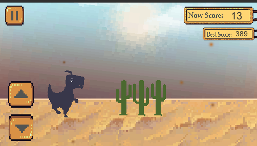

**午夜时：**
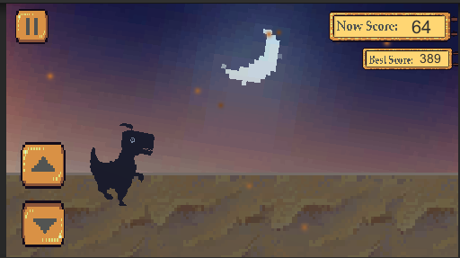

#### 3.3.3.2 解决思路

背景时间环是一直在转动的，可以根据当前的转动角度来决定灯光的强度与颜色属性。
分析可得以下映射表：

| 时间 | 角度a | 灯光强度s | 灯光颜色c |
| ---- | ---- | ---- | ---- |
| 正午   | 0° | 1.5 | 255，244，214 |
| 午夜 | -180° | 0.25 | 144，259，204 |

可以看出输入值是角度，输出值是灯光强度与灯光颜色，而这两个输出值都是在一定范围内周期性变化。
由此可想到使用三角函数公式。

**灯光强度公式如下：**
$s=0.625cos(a)+0.65$

因为开始旋转角度为0时是正午，灯光强度为最大值1.5，所以使用cos函数
其中振幅A = 0.625 是根据(1.5-0.25)/2得到的。

#### 3.3.3.3 代码实现

时间环控制代码如下：

```c#
public class TimeRingController : MonoBehaviour
{
    public LightController LC;
    public Vector3 playSpeed;
    private bool isDayTime;
    private bool isPlaying;

    public bool IsDayTime { get => isDayTime; set => setTime(value); }
    public bool IsPlaying { get => isPlaying; set => isPlaying = value; }

    void Start()
    {
        LC = GameObject.Find("Light").GetComponent<LightController>();
        isDayTime = true;
        isPlaying = false;
    }
    //转动时间环函数
    private void FixedUpdate()
    {
        if (isPlaying)
        {
            transform.Rotate(playSpeed, Space.Self);
            //根据当前角度设置灯光属性
            LC.setTimeByAngle(transform.rotation.eulerAngles.z);
        }
            
    }
    private void setTime(bool isDayTime)
    {
        this.isDayTime = isDayTime;
        if (isDayTime)
        {
            transform.rotation = Quaternion.Euler(new Vector3(0, 0, 0));
            LC.setTime(true);
        }
        else
        {
            transform.rotation = Quaternion.Euler(new Vector3(0, 180, 0));
            LC.setTime(false);
        }
            
    }
}
```

灯光控制代码如下：

```c#
using UnityEngine;

public class LightController : MonoBehaviour
{
    private Light theLight;
    public float maxInstensity;
    public float minInstensity;
    public Color dayTimeColor;
    public Color nightTimeColor;
    public float speed;

    private void Start()
    {
        theLight = gameObject.GetComponent<Light>();
    }
    //三角函数的实现
    private float trigonometric(float min, float max,float angle)
    {
        float rad = angle * Mathf.Deg2Rad;
        float A = (max - min) / 2.0f;
        float fai = min + A;
        return A * Mathf.Cos(rad) + fai;
    }
    //根据角度转换灯光属性
    public void setTimeByAngle(float angle)
    {
        theLight.intensity = trigonometric(minInstensity,maxInstensity,angle);
        if(100<angle && angle<200)
            theLight.color = nightTimeColor;
        else
            theLight.color = dayTimeColor;
    }
    public void setTime(bool isDayTime)
    {
        if (isDayTime)
        {
            theLight.intensity = maxInstensity;
            theLight.color = dayTimeColor;
        }
        else
        {
            theLight.intensity = minInstensity;
            theLight.color = nightTimeColor;
        }
    }
}
```

#### 3.3.3.4 需要注意的点

- GameObject的transform.rotation属性是四元数，得转换为欧拉角然后再转换为弧度制才能使用
- 2D精灵是无法对3D的灯光有反应的
  因为2D精灵使用的是默认的2D图片材质
  想要让3D灯光在2D精灵图片上有效果，需要自定义材质
  如下图所示：
  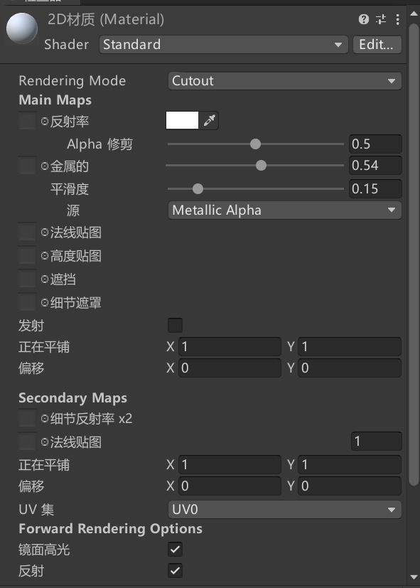
  其中渲染模式(RenderingMode)要设置为：Cutout，其它设置根据需求进行更改。

### 3.3.4 不同画面比的自适应匹配

#### 3.3.4.1 效果描述

当游戏打包发布到安卓端时，需要解决目前市场上各式各样屏幕比例的自适应问题。
UI方面只要在编辑器中设置好就问题不大，主要是游戏实体的缩放与生成和销毁位置的问题。

需求如下：

- 陆地块的生成位置必须在屏幕外
- 陆地块的开始运动位置必须在屏幕右侧边缘
- 陆地块运动至屏幕外需要销毁
- 陆地块右侧边缘位于屏幕右侧边缘时，需要启动下一个陆地块
- 时间环无论在什么屏幕下都应该充满背景

#### 3.3.4.2 代码实现

想要实现如上需求，就必须要知道屏幕的边缘在哪里，也就是将屏幕的边缘坐标从屏幕坐标转化为世界坐标。可以通过如下代码实现：

```c#
public float leftBorder;
public float rightBorder;
public float topBorder;
public float downBorder;
public float height;
public float width;
public Vector3 scale;
public void initBorder()
{
    //世界坐标的右上角  因为视口坐标右上角是1,1,点
    Vector3 cornerPos = Camera.main.ViewportToWorldPoint(new Vector3(1f, 1f,Mathf.Abs(-Camera.main.transform.position.z)));
    //世界坐标左边界
    leftBorder = Camera.main.transform.position.x - (cornerPos.x - Camera.main.transform.position.x);
    //世界坐标右边界
    rightBorder = cornerPos.x;
    //世界坐标上边界
    topBorder = cornerPos.y;
    //世界坐标下边界
    downBorder = Camera.main.transform.position.y - (cornerPos.y - Camera.main.transform.position.y);
    width = rightBorder - leftBorder;
    height = topBorder - downBorder;
    //在默认比例:16:9下的宽高
    float deffultH = 13.85643f;
    float deffultW = 24.60183f;
    //缩放求出比例
    scale = new Vector3(width/deffultW, height/deffultH, 0);
}
```

把上述代码挂在到摄像机上，当摄像机就位后运行，就能得到：

- 画面四个边界的世界坐标
- 当前画面比例下与默认画面比例的缩放比

其中物体运行到视野外销毁还可以使用另一种方法：
使用**OnBecameInvisible()**函数

```c#
//物体进入视野内触发响应函数
public void OnBecameVisible(){}
//物体离开视野内触发响应函数
public void OnBecameInvisible(){}
```

